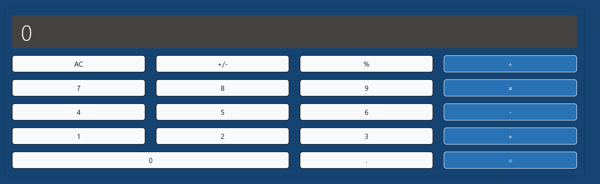

# Calculator

A simple and responsive calculator built with HTML, CSS, and JavaScript. This project uses Bootstrap for styling and includes custom styles for a unique look.

## Features

- Basic arithmetic operations: addition, subtraction, multiplication, and division.
- Percentage calculation.
- Toggle between positive and negative numbers.
- Clear display functionality.
- Responsive design for various screen sizes.

## Screenshot



## Technologies Used

- **HTML**: Structure of the calculator.
- **CSS**: Custom styles and Bootstrap for responsive design.
- **JavaScript**: Logic for calculator operations.

## How to Use

1. Clone the repository:
   ```bash
   git clone https://github.com/your-repo/calculator.git
2. Open `index.html` in your browser.
3. Use the buttons to perform calculations.

